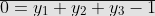
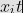

## RSundials: An Package For Solving Systems of Differential Equations with Particular Respect to Biochemical Networks (version 1.6)

---
### Contents
* [Summary](#summary)  
* [IDA Example](#ida-example)  
* [CVODES Example](#cvodes-example)  
* [Rootfinding](#rootfinding)  
* [Passing Data](#passing-data)  
* [References](#references)  

<a name="summary"></a>
## Summary
Rsundials implements the differential algebraic equation (DAE) and ordinary differential equation (ODE) solvers in the SUNDIALS suite (version 2.3.0 – http://www.llnl.gov/CASC/sundials/). The IDA module of SUNDIALS handles DAEs and the CVODES module solves ODE systems. Both modules utilize a dense linear solver and both require a user-defined (hard-coded) residual / right hand side function. Installation of the SUNDIALS libraries is not a prerequisite for this package.

<a name="ida-exmaple"></a>
## IDA Example
### The Problem
This example, due to Robertson [[1]](#1), is a model of a three-species chemical kinetics system written in DAE form. Differential equations are given for species y1 and y2 while an algebraic equation determines y3. The equations for the system concentrations yi(t) are:

 
d



The initial values are taken as y1 = 1, y2 = 0, and y3 = 0. This example computes the three
concentration components on the interval from t = 0 through t = 4×10^10


### The Residual Function
The first step is to create a compilable file (preferably in c/++) that defines the residual (right hand side) function as called by the solver on each time step. A template for such a function can be described as:

```c++
#include "include/nvector_serial.h" 
#include "include/sundials_dense.h"

int resrob(realtype tres, N_Vector yy, N_Vector yp, N_Vector rr, void *rdata)
{
	realtype *yval, *ypval, *rval;
	yval = NV_DATA_S(yy); ypval = NV_DATA_S(yp); rval = NV_DATA_S(rr);

	/* Set values of rval[0]...rval[n] here */

	return(0); 
}
```

The function takes these arguments:

| Command | Description |
| --- | --- |
| __tres__ | the current value of the independent variable |
| __yy__ | the current value of the dependent variable vector, y(t)
| __yp__ | the current value of y'(t) |
| __rr__ | the output residual vector F(t, y, y') |
| __rdata__ | a pointer to user data |

The two `include`s are used to bring in the data types used by the SUNDIALS solver, namely `N_Vector`, a simple vector, and `realtype`, a primitive data type. By default, this is a double-precision floating-point numeric data type (double C-type). The header files are found in the usrfcns directory.

In order to write or read from the vectors, __NV_DATA_S__ must be used on a realtype pointer. This sets the pointer to the first value of the vector. In general, nothing must be done with __tres__ or __rdata__.

IDA works by attempting to minimize the residual of the equations presented. As such, it is important to formulate the system properly by bringing everything over to one side. The output residual vector __rr__ can be written to by writing to the elements of rval. For the above system, this can be done in the following way:

```c++
rval[0] = -0.04*yval[0] + 1.0e4*yval[1]*yval[2] - ypval[0]; 
rval[1] = 0.04*yval[0] - 1.0e4*yval[1]*yval[2] - 3.0e7*yval[1]*yval[1] - ypval[1]
rval[2] = yval[0] + yval[1] + yval[2] - 1;
```

If the complete function __resrob__ is placed in the file _idafcns.c_, it can be compiled into a
shared library useable by R using:

`
     R CMD SHLIB ...path.../idafcns.c
`	

The header files _nvector_serial.h_ and _ida_dense.h_ should be present in the same directory. This will compile the file and allow the functions within to be usable in R.

### Solving the Problem in R
Once R is started, the defined functions must be loaded before running the IDA solver. To load dynamic libraries into R, use: `dyn.load("...path.../idafcns.so")` (\*nix) or `dyn.load("...path.../idafcns.dll")` (Windows).

To execute the IDA solver in R, the following command might be used:

```R
     yvals <- ida(c(1,0,0), c(-0.04,0.04,0),
          gseq(.4,4e10,10), "idafcns", "resrob", jacfunc =
          "jacrob", rtol = 1E-4, atol = c(1E-8,1E-14,1E-6),
          verbose = TRUE)
```

The following output (or something similar) should be obtained:

```
SUNDIALS IDADENSE Linear Solver Number of Equations: 3 
Integration Limits: 0.4 to 4e+10 
Solver Memory Allocated
Max Number of Steps: 500
Max step size: 0
Relative Tolerance: 0.0001
Absolute Tolerances: 1e-08 1e-14 1e-06 
Jacobian Function Initialized
IDADense Linear Solver Initialized
```

| t | y0 | y1 | y2 | nst | k | h |
| --- | --- | --- | --- | --- | --- | --- |
| 4.0000e+00 | 9.1172e-01 | 2.3133e-05 | 8.8253e-02 | 96 | 4 | 4.1520e-01|
| 4.0000e+01 | 7.1686e-01 | 9.2258e-06 | 2.8313e-01 | 132| 4 | 1.9421e+00|
| 4.0000e+02 | 4.5066e-01 | 3.2247e-06 | 5.4933e-01 | 177| 4 | 3.2576e+01|
| 4.0000e+03 | 1.8321e-01 | 8.9427e-07 | 8.1679e-01 | 220| 4 | 2.0527e+02|
| 4.0000e+04 | 3.8985e-02 | 1.6218e-07 | 9.6102e-01 | 266| 3 | 1.2965e+03|
| 4.0000e+05 | 4.9391e-03 | 1.9853e-08 | 9.9506e-01 | 307| 5 | 1.6802e+04|
| 4.0000e+06 | 5.1672e-04 | 2.0679e-09 | 9.9948e-01 | 366| 3 | 1.5150e+05|
| 4.0000e+07 | 5.2026e-05 | 2.0811e-10 | 9.9995e-01 | 416| 4 | 2.0066e+06|
| 4.0000e+08 | 5.2132e-06 | 2.0853e-11 | 9.9999e-01 | 452| 4 | 2.7282e+07|
| 4.0000e+09 | 5.2178e-07 | 2.0871e-12 | 1.0000e+00 | 482| 4 | 2.6574e+08|
| 4.0000e+10 | 5.1049e-08 | 2.0420e-13 | 1.0000e+00 | 503| 2 | 6.8880e+09|

```
Final Run Statistics:
Number of steps = 503
Number of residual evaluations = 703
Number of Jacobian evaluations = 78
Number of nonlinear iterations = 703
Number of error test failures = 16
Number of nonlinear conv. failures = 0
Number of root fn. evaluations = 0
```

## CVODES Example

### Summary  

This is an implementation using CVODES, solves ODE systems and includes sensitivity analysis capabilities. It also allows for explicit compartmentalization, illustrated below.

### The Problem (A Different One)

This example from a presentation by Borrelli and Coleman [[2]](#2) is a three-compartment model for lead in the human body. Lead is input to the system at a constant rate _L_. Three state variables, _x1_, _x2_, and _x3_ describe the concentration of lead in the blood, tissue, and bones respectively. There exist transfer rates between the compartments as well as to the external environment via urine from the blood and via hair, nails, and sweat from the tissues.


For _i = 1, 2, 3_, we let  be the amount of lead in compartment i at time t and we assume that the rate of transfer from compartment i to j is proportional to xi(t) with a proportionality constant of aji. The units for amounts of lead are micrograms and the time t is measured in days.

The vector differential equation of this problem is in the form



where __A__ is the matrix:


and 


In a paper published by Rabinowitz and colleagues [[3]](#3), measurements of the concentration of lead in these compartments in a male subject living in Los Angeles allowed for the calculation of the rates of transfer. Relatively speaking, lead is somewhat slow to enter the bones and very slow to leave them.

_per_ __Lead Transfer Coefficients (Rabinowitz, et al.)__:

| Param1 | Param2 | Description |
| --- | --- | --- |
|a_21 = 0.011 | a_12 = 0.012 | _from blood to tissue and back_|
|a_31 = 0.0039 | a_13 = 0.000035 | _from blood to bone and back_|
|a_01 = 0.021 | a_02 = 0.016 | _excretion from blood and tissue_|

*(units = days^-1)*

The study also showed that the average rate of ingestion of lead (__L__) in Los Angeles over the period studied was __49.3__ micrograms per day.

*The Right Hand Side Function*  

The first step is to create a compilable file (preferably in c) that defines the right hand side function as called by the solver on each time step. A template for such a function can be described as:

```c++
#include "include/nvector_serial.h" #include "include/sundials_dense.h"

int rhs(realtype t, N_Vector y, N_Vector ydot, void *f_data)
{
	realtype y1, y2, y3;
	y1 = Ith(y,1); y2 = Ith(y,2); y3 = Ith(y,3);
	
	/* Change values of ydot here using Ith(ydot,i) */

	return(0); 
}
```

The function takes the arguments:

| Command | Description |
| --- | --- |
| __t__ | the current value of the independent variable |
| __y__ | the current value of the dependent variable vector, y(t)
| __yp__ | the current value of y'(t) |
| __fdata__ | a pointer to user data |


As in the IDA example, the two `include`s are used to obtain the data types used by the SUNDIALS solver, namely **N_Vector**, a simple vector, and **realtype**, a primitive data type. Again, by default, this is a double-precision floating-point numeric data type (double C-type). The header files are found in the __usrfcns__ directory.

The realtypes y1, y2 and y3 are first set to the corresponding value in the y vector using the macro Ith with indices from 1 to n (not from 0 to n-1). These can then be modified to reflect the proper value. For the above problem, the values of __ydot__ can be updated using the following code:

```c++
double L = 49.3;
double a21 = 0.011; double a12 = 0.012; 
double a31 = 0.0039; double a13 = 0.000035; 
double a01 = 0.021; double a02 = 0.016;

Ith(ydot, 1) = -(a01 + a21 + a31)*y1 + a12*y2 + a13*y3 + L; 
Ith(ydot, 2) = a21*y1 - (a02 + a12)*y2;
Ith(ydot, 3) = a31*y1 - a13*y3;
```

If the complete function __rhs__ is placed in the file _cvodesfcns.c_, compile to shared library as above:


`
     R CMD SHLIB ...path.../cvodesfcns.c
`	


The user may supply a method for computing the Jacobian; this can be placed in the same file as the RHS method.

### Solving the Problem in R

Using the model defined above, let's take a look at an individual who moves to Los Angles with no lead in her body. We can use Rsundials to determine the levels in her system after a set number of days, say 400.

As a reminder, load the libraries: `dyn.load("...path.../cvodesfcns.so")` (\*nix) or `dyn.load("...path.../cvodesfcns.dll")` (Windows).

Once in R:

```R
depending on your system type. To execute the CVODES solver in R, the following command might be used:
     yvals <-
          cvodes(c(0.0,0.0,0.0),seq(0,400,20),"cvodesfcns",
At t = 2.0000e+01 At t = 4.0000e+01 At t = 6.0000e+01 At t = 8.0000e+01 At t = 1.0000e+02 At t = 1.2000e+02 At t = 1.4000e+02 At t = 1.6000e+02 At t = 1.8000e+02 At t = 2.0000e+02 At t = 2.2000e+02 At t = 2.4000e+02 At t = 2.6000e+02 At t = 2.8000e+02 At t = 3.0000e+02 At t = 3.2000e+02 At t = 3.4000e+02 At t = 3.6000e+02 At t = 3.8000e+02 At t = 4.0000e+02
```

And sample output:

```
SUNDIALS CVODES Linear Solver
Number of Equations: 3
Integration Limits: 0 to 400 
InitialValues: y0=0 y1=0 y2=0 
Solver Memory Allocated
Relative Tolerance: 0.0001
Absolute Tolerances: 1e-08
CVDENSE Solver Initiated
Max number of steps: 500
Max step size: 0
Requesting data for all time points.
```

and after

```
Number of steps = 73
Number of RHS evaluations = 89
Number of linear solver setups = 31
Number of nonlinear iterations = 85 
Number of error test failures = 1 
Number of nonlinear conv. failures = 0
Number of root fn. evaluations = 0
```

And finally after 400 itegrations:

| |  ||||
|--|--|--|--|---|
|[,1]|      [,2]|      |[,3]       |[,4]|
[1,] |   0 |   0.0000 |  0.00000 |   0.00000|
[2,] |  20 | 708.8272 | 71.98569 |  30.79803|
[3,] |  40 |1073.4351 |197.27204 | 101.75408|
[4,] |  60 |1272.2696 |313.41340 | 193.87588|
[5,] |  80 |1386.8700 |404.75483 | 297.80714|
[6,] | 100 |1456.0422 |471.69985 | 408.66104|
[7,] | 120 |1499.4004 |518.98131 | 523.72549|
[8,] | 140 |1527.1425 |551.81292 | 641.44779|
[9,] | 160 |1545.1407 |574.37374 | 760.86810|
[10,] | 180 |1557.1780 |589.65408 | 881.34927|
[11,] | 200 |1565.4186 |599.92632 |1002.49768|
[12,] | 220 |1570.9726 |606.90308 |1124.08405|
[13,] | 240 |1574.6646 |611.67520 |1245.94737|
[14,] | 260 |1577.1821 |614.90883 |1367.96547|
[15,] | 280 |1578.9551 |617.08536 |1490.05834|
[16,] | 300 |1580.1895 |618.57552 |1612.18045|
[17,] | 320 |1581.0423 |619.61078 |1734.29997|
[18,] | 340 |1581.6483 |620.33370 |1856.39243|
[19,] | 360 |1582.1063 |620.83745 |1978.44042|
[20,] | 380 |1582.4672 |621.19300 |2100.43377|
[21,] | 400 |1582.7678 |621.44568 |2222.36541|

<a name="root-finding"></a>
### Rootfinding

Rootfinding is the determination of the roots of a set of functions gi that depend both on t and on the solution vector y = y(t). Generally, this rootfinding feature finds only roots of odd multiplicity, corresponding to changes in sign of g(t, y(t)). The user function is called at every timestep and if a change of sign is determined, the solution is honed in on.

The general form of the rootfinding function is as follows:

```c++
int g(realtype t, N_Vector y, realtype *gout, void *data)
{
  realtype y1, y3;
  yvec = NV_DATA_S(y);

	// Example: Does y1 = 0.0001 ?
	gout[0] = y1 - RCONST(0.0001);

  return(0);
}
```

| Command | Description |
| --- | --- |
| __t__ | the current value of the independent variable.  |
| __y__ | the current value of the dependent variable vector, y(t)|
| __gout__ | the output array, of length nrtfn, with components gi (t, y). |
| __g__ | data is the g the data pointer |

The function should return `0` if successful or a `non-zero` value if an error occurred (in which case the integration is halted).


<a name="passing-data"></a>

### Passing Data

Data can be passed from R to the user-defined functions via the _fndata_ argument. This data can be of any numeric type and is stored as double variables for precision. 

As an example, parameters might be updated upon successive invocations of either solver:

```R
K1 = 34.3; K2 = 5.4; K3 = 0

yvals <- cvodes(c(2.3, 1.0),seq(0,20,1),"cvodesfcns","rhs", fndata = c(K1,K2,K3), 
				rtol = 1E-4,atol = c(1E-8,1E-14,1E-6),verbose = TRUE)

K1 = 34.4; K2 = 5.4; K3 = 0.1

yvals <- cvodes(c(2.3, 1.0),seq(0,20,1),"cvodesfcns","rhs", fndata = c(K1,K2,K3), 
				rtol = 1E-4,atol = c(1E-8,1E-14,1E-6),verbose = TRUE)
```

To retrieve the data in your function, simply use the code:

```
	double *d = (double *) data;
```

The elements can now be accessed via `d`.


<a name="references"></a>

### References
<a name="1">[1]</a> H. H. Robertson. The solution of a set of reaction rate equations. In J. Walsh, editor, Numerical analysis: an introduction, pages 178–182. Academ. Press, 1966.  
<a name="2">[2]</a> Differential Equations: A Modeling Approach, by R. Borrelli and C. Coleman, Prentice-Hall, 1987.  
<a name="3">[3]</a> Rabinowitz MB, Wetherill GW, Kopple JD. Lead metabolism in the normal human: stable isotope studies. Science. 1973 Nov 16;182(113):725–727.
